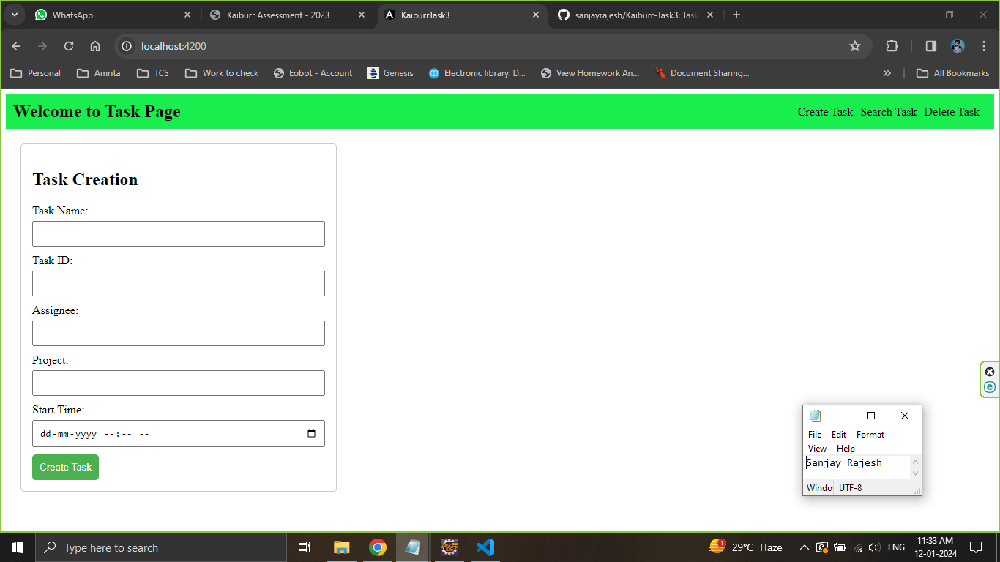
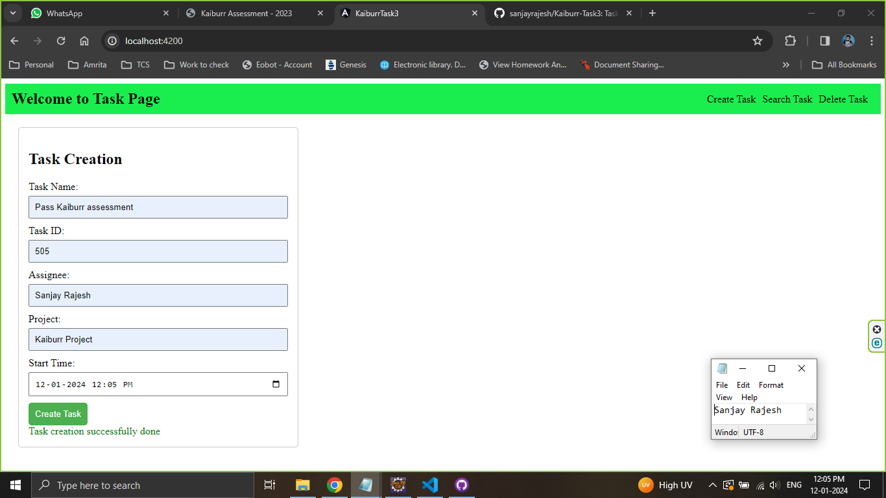
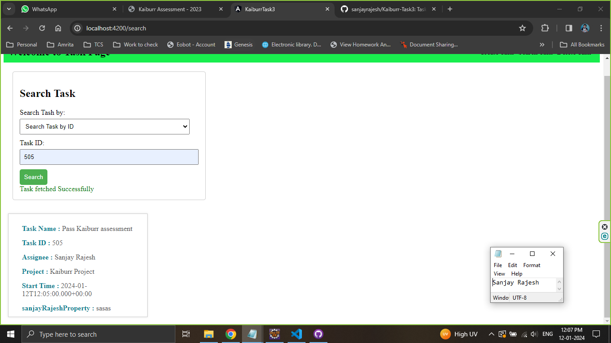
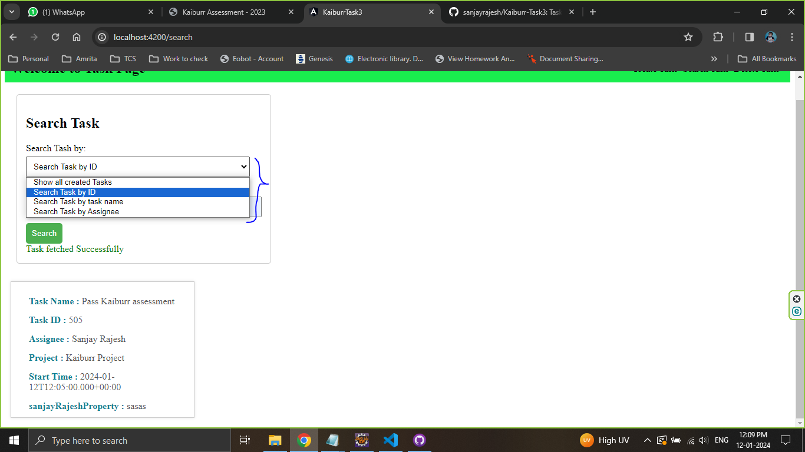
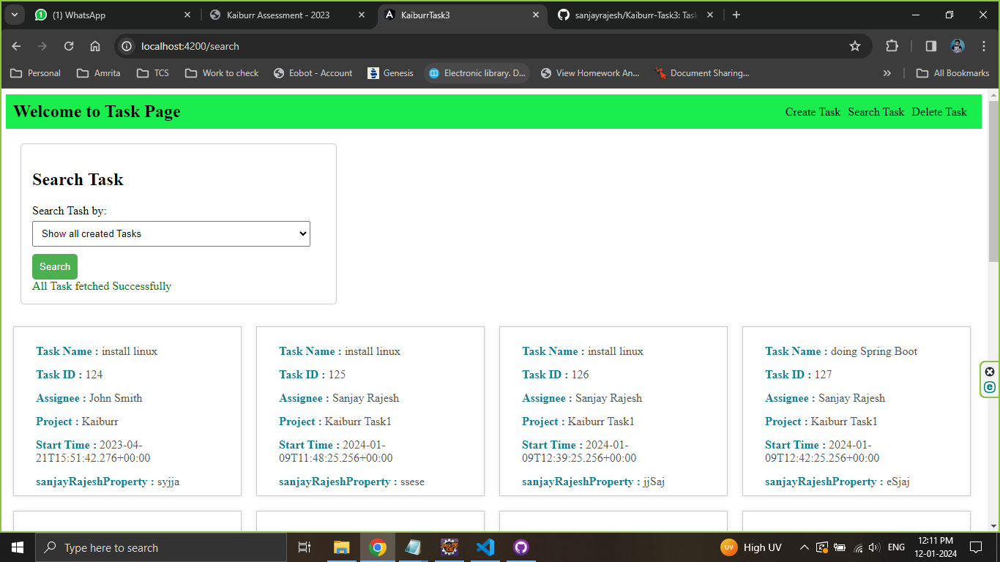
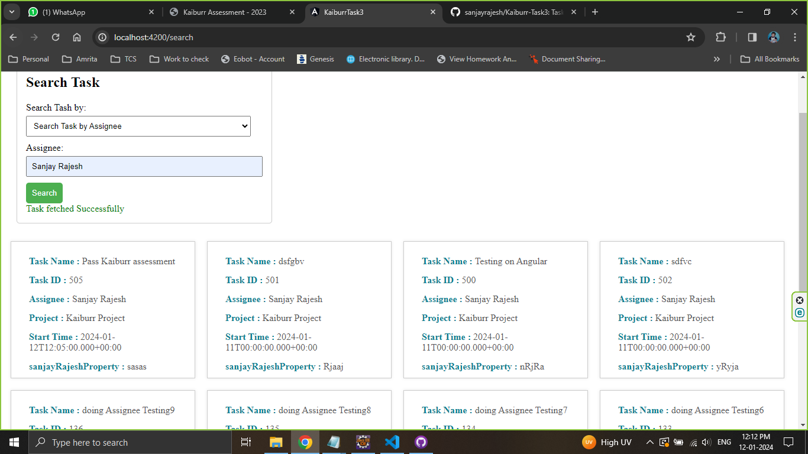
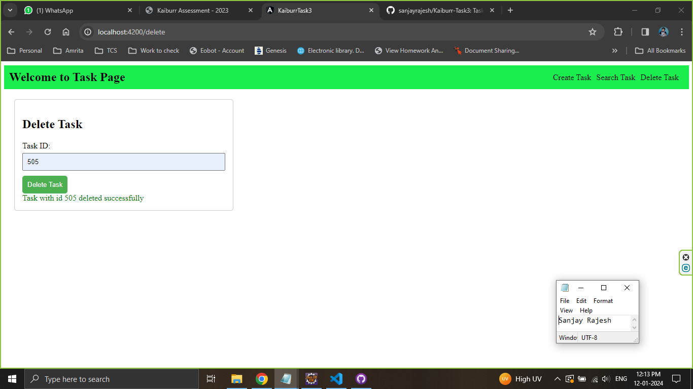
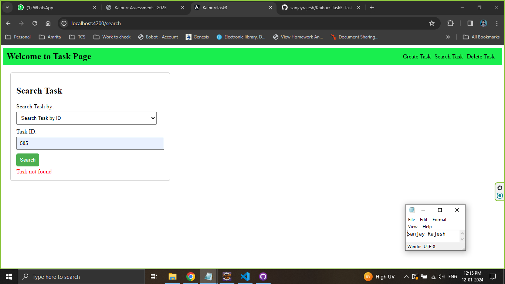

# Kaiburr-Task3
Task 3. WEB UI Forms

The UI is made using Angular. I have used Angular `ReactiveForms` to create Forms for Task creation, search and deletion. Angular takes the inputs from the Users and sends it to the spring boot backend we created in Task1. The Response from spring boot is handled in Angular using `HttpClient` module.

The coding is done on VS code and is run on command prompt with the command `ng serve`. We just have to also make sure that the spring boot backend is also running along with it. spring boot by default on tomcat runs on port 8080 and angular defaultly runs on port 4200.

The App mainly has:
1. A total of 4 components. The `AppComponent` which act as the main page has the top header and the navigation options. Then the remaing components are `CreatetaskComponent`, `SearchtaskComponent`, and `DeletetaskComponent` each of them has `ReactiveForms` which take inputs from users and execute the actions.
2. A Task model class created to represent each Tasks.
3. Finally 3 services class each for Task creation, searching and deletion this has the HttpClient object taking user inputs and send it to the spring boot backend.

# UI Demo

This is the main page when we access `http://localhost:4200`. Using Routing mechanism in Angular, we have set the Task creation page to load as the main page.

This is the screenshot of Task creation.

We can search the same Task that we just created on the Search Task tab option

There are different option to search for Tasks

Here is a screenshot to show all created Tasks

Same was we can search for Tasks with the Task Name and Assignee, here is a screenshot of searching by Assignee name:

There is also option to delete a Task just by provinding the Task ID

If we try to search a Task that is deleted or has not created yet, we will get the below message:

# References taken

[Reactive forms](https://angular.io/guide/reactive-forms)